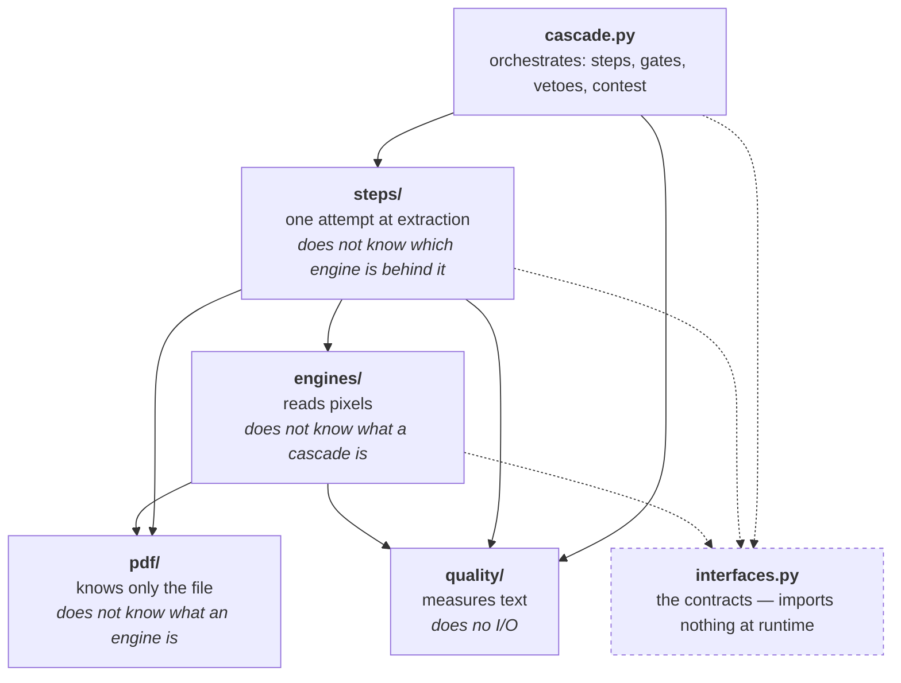
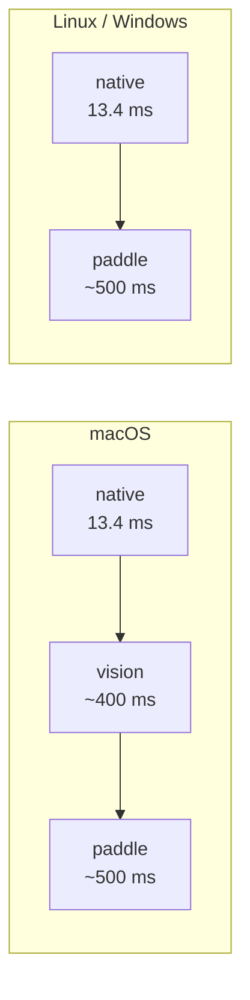

# Architecture

## The layer rule

Five layers, and one direction. This is CLAUDE.md §10, and it is the load-bearing
rule of the codebase:

```
pdf/         knows only the file    — does not know what an engine is
quality/     knows only text        — does no I/O
engines/     reads pixels           — does not know what a cascade is
steps/       composes the two       — does not know which engine is behind it
cascade.py   orchestrates
```

**If an import crosses the arrow backwards, the design has broken.** That is not
tidiness. It is the boundary that let the OCR step be a *single*, generic step
serving Apple Vision and PP-OCRv6 alike: `steps/ocr.py` names no engine, so
adding an engine costs one file and changes nothing else.



Solid arrows are runtime imports and every one of them points **down**. The
dashed arrows are the contracts: [`interfaces.py`](interfaces.md) mentions every
type it describes only under `if TYPE_CHECKING`, so importing a contract never
drags in what implements it. That is what puts it *below* all five layers while
depending on none of them, and
`tests/test_interfaces.py::test_the_module_pulls_in_nothing_at_import_time` is
what keeps it there.

There is one more property worth naming, because it is the reason the rule pays
for itself: `quality/` does no I/O and takes no configuration object, only
numbers. So the same function can be called from inside a step (*did I solve
it?*) and from the cascade (*is the next step worth paying for?*) at no cost —
which is the mechanism behind [one acceptance criterion](adr/index.md#0002-one-acceptance-criterion).

## The cascade, per platform



Before any of those steps sees a pixel, the page is turned upright. The
orientation fix lives in the **render cache** (`steps/base.py`), not in a step,
because it is a property of the input rather than an attempt at extraction: a
sideways page is read badly by every engine, and the gates downstream would
otherwise measure an input defect they cannot see. It costs an OSD pass per
**rasterised** page, so a document resolved by the native text layer pays
nothing, and the availability check runs once per document rather than once per
page. Without the `[veto]` extra the correction is skipped and says so in the
provenance and in `diagnose` — it is never a silent no-op.

That is literally what `Cascade().names` returns — `['native', 'paddle']` on
Linux, `['native', 'vision', 'paddle']` on a Mac. `UnwrapStep` and
`ScreeningStep` exist and are exported from the package root, but **they are not
assembled by default**: you pass them in `steps=`. The gates below are not steps
at all — they run inside `Cascade.extract` and cannot be left out.

Nothing about the cascade changes with the platform except that one missing
layer — same steps, same gates, same contest. PP-OCRv6 is **not** Vision's
substitute on a Mac; it is the step below it, and the second independent reading
the [agreement gate](gates.md#agreement) needs in order to fire at all.

| step | cost per document | resolves | notes |
|---|---|---|---|
| `unwrap` *(opt-in)* | ~0.1 ms | — | RTF, BRy envelope, PKCS#7. Almost never fires; on a real PDF it costs reading 16 bytes. It exists because **128 documents of a real archive arrive as `.pdf` while being something else**, and PyMuPDF raises `Failed to open stream` on them. No OCR recovers those — there is no image, there is plain text nobody was reading. [Files that are not PDFs →](formats.md) |
| `native` | 13.4 ms | 31% | PyMuPDF's text layer |
| `vision` | ~400 ms | the bulk | Apple only. 92% of words and 100% of numeric anchors preserved at the median of 60 audited documents |
| `paddle` | ~500 ms | the bulk, off Apple | PP-OCRv6 tiny on ONNX |
| gates | ~0 | the remainder | consensus, agreement, contest |

`Cascade._assemble` builds that list from `engine_order(config)`, which reads the
registry, filters by platform, filters by what actually loads, and applies two
rules that are not obvious:

- `ocrmac` enters only if `vision` did not. They are the same Apple engine and
  the second is the first's safety net.
- **The witness never transcribes.** `config.veto_engine` — Tesseract by default
  — is left out of the chain entirely. An engine that both produces a candidate
  and vouches for the others is no independent evidence at all: the veto asks
  *"does a different architecture also see text here?"*, and it cannot answer
  that about its own output.

`config.engines` overrides both rules, including by naming an unavailable
engine. That becomes a refused attempt with the reason, never an error —
silencing the operator's choice would be worse.

## The machine every number was measured on

A timing without its machine is not falsifiable, so here is the machine. Every
number on this site comes from one of two, and **neither has a discrete GPU**:
there is no CUDA path in this library, `pyproject.toml` declares none, and the
ONNX runtime defaults to `CPUExecutionProvider`.

| | |
|---|---|
| **Linux** | 2 × Intel Xeon E5-2699 v3 @ 2.30 GHz (turbo 3.60), dual socket — **36 physical cores, 72 logical**, 2 NUMA nodes, 125 GiB RAM, x86_64, Debian 13, kernel 6.12. Bare metal, no cgroup quota, full affinity. |
| **macOS** | MacBook Air M5 — Apple silicon, **passively cooled**. PP-OCRv6, onnxtr and Tesseract run on the **CPU**; Apple Vision runs on the **Neural Engine**. |

Three details of those two that are load-bearing rather than decorative.

The Linux box is **dual socket**, so part of why the thread table flattens above
four threads is cross-socket memory, not the model. The "2 cores" column in
[ADR 0010](adr/index.md#0010-parallelism-is-decided-by-the-machine) is this same
machine restricted with `taskset` — a real 2-core machine of a later generation
would be faster per core and would still plateau, because the shape of that
curve is the point, not its height.

The Mac is a **fanless** laptop. Sustained figures over hundreds of documents —
the 935-document runs, the ~2.5 pages/s ceiling — are what a passively cooled
machine delivers over a long batch, which is the number worth having if you are
sizing a job, and is not the number a short burst would show.

And Vision on the Neural Engine is precisely why "everything was measured on
CPU" would be the convenient sentence and the false one: the single hardware
queue that makes its throughput flat against threads is not the CPU.

Two consequences worth stating before someone else states them for you.

**A GPU would change the arithmetic, and not the argument.** `6.2 min against
4.44` is a CPU-against-CPU comparison; put a GPU behind the single model and it
narrows, possibly to nothing. What no accelerator touches is the distribution:
**31% of documents need no model at all**, and no hardware makes reading an
existing text layer cheaper than 13.4 ms. The cascade's claim is about which
documents you skip, not about how fast you run the model you did not need.

**These are wall-clock times on a loaded, shared machine**, not a benchmark
harness. Treat them as ratios between steps — which is how every decision here
used them — rather than as absolute numbers to reproduce on your hardware.

## Where a decision is made, and where it is measured

This is the distinction that keeps the pipeline auditable, and the one most
easily lost when adding code.

| | measures | decides |
|---|---|---|
| `quality/` | ✅ every threshold comparison lives here | ❌ never — it returns a verdict and a sentence |
| `steps/` | ❌ | partially: a step decides only whether *it* succeeded, by calling `quality/gate.py` |
| `cascade.py` | ❌ | ✅ whether to continue, what to veto, what may replace what, who wins |
| `engines/` | ❌ | ❌ an engine reads pixels; it does not judge its own output |

Concretely: `quality.gate.evaluate` returns a `Verdict(escalate, reason)`. It
never stops a cascade, never logs, never raises. `quality.vetoes.assess_vetoes`
returns a `Veto` or `None`. `quality.rejection.assess_replacement` returns a
verdict with warnings. `quality.consensus` returns evidence. In every case the
*decision* — stop, skip, discard, close — is taken in `cascade.py`, one file, in
one method each.

The payoff is threefold:

1. **Every judgement is testable without a PDF.** `tests/test_gate.py`,
   `test_vetoes.py`, `test_rejection.py` pass text and numbers to a pure function.
2. **Every judgement is explainable.** The verdict carries the sentence, the
   sentence reaches `Attempt.reason`, and `Result.provenance` is the
   concatenation. A gate returning a bare `bool` would satisfy the cascade and
   destroy that.
3. **The same measurement can be asked twice from different places** — which is
   what makes one acceptance criterion possible at all.

The inverse mistake is worth naming, because it looks like a simplification: a
step that decides on its own whether to escalate. It ends with two competing
notions of "adequate extraction" in one pipeline, the step approving itself by
one criterion and the cascade refusing it by another.
[ADR 0002](adr/index.md#0002-one-acceptance-criterion) is that defect written down.

## The platform decides twice

| when | who decides | what |
|---|---|---|
| at `pip install` | a PEP 508 marker in `pyproject.toml`, evaluated by pip | what is **installed** |
| at the first extraction | `platform.py` plus the registry in `engines/base.py` | what is **available** |

Both layers are necessary, and the temptation to delete the second because "the
first already guarantees it" is wrong: the first guarantees the *common case*.
An image built for another platform, an install with `--no-deps`, a lockfile for
another `sys_platform`, an incomplete `pyobjc` — in each of those the marker did
not match, and the second layer is what makes the cascade degrade with a warning
instead of blowing up on the first document. `tests/test_packaging.py` pins the
first; `tests/test_engines.py` pins the second.

## The map of the package

```
autosxtract/
  cascade.py        the orchestrator — steps, gates, vetoes, contest
  config.py         every threshold, each with the measurement that fixed it
  interfaces.py     the eleven contracts; imports nothing at runtime
  patterns/         the pattern catalogue: loader + data/*.toml
  types.py          Line, Page, Transcription, Candidate, Attempt, Result
  formats.py        RTF / BRy / PKCS#7 — is the file really a PDF?
  platform.py       Apple or not; the only hardware-dependent decision
  resources.py      how many cores there really are (affinity, cgroup, cpu_count)
  image.py          image dimensions from the header, with no dependency
  pdf/              lock, render, profile, coverage, ink, orientation, pages
  quality/          stamp, metrics, gate, consensus, anchors, prose, screening,
                    markers, vetoes, rejection, lines, lexicon, routing, scoring
  engines/          vision, paddle, onnx, tesseract, signature (YOLO) + registry
  steps/            native, ocr, unwrap, screening, layers, docling_local, remote
```

Two of those are newer than the rest and are what this documentation exists to
explain: [`interfaces.py`](interfaces.md), where every contract is declared, and
[`patterns/`](extending/patterns.md), where every domain regex now lives as data.
