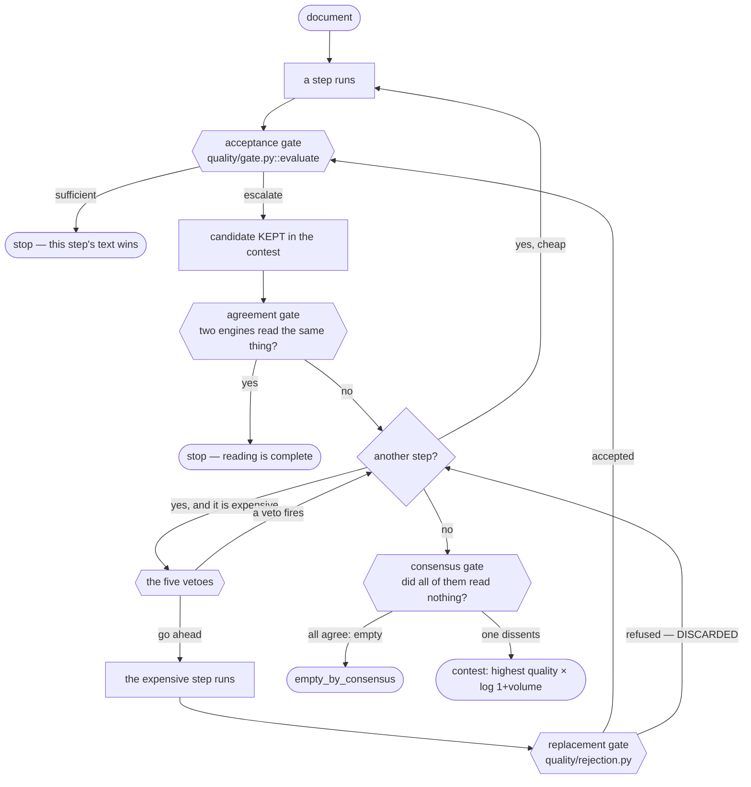

# Quality gates

Everything in this page exists to answer one of two questions, and confusing
them is the easy mistake:

- **Is this text good enough to stop the cascade?** → the *acceptance* gate.
  Something refused here **stays in the contest**.
- **Is this text better than what I already had, and did it lose nothing?** →
  the *replacement* gate. Something refused here is **discarded**.

The first compares against a threshold; the second compares against a concrete
text and has already concluded the new one is worse.



---

## The acceptance gate

`quality/gate.py::evaluate` — **one function, one criterion, called from both
sides of every decision.**

Whoever decides the current step solved it and whoever decides the next one is
worth paying for ask the same question, with the same code. Two competing
notions of "adequate extraction" in one pipeline was the defect this function
exists to avoid repeating: the step approved itself by one criterion and the
cascade refused it by another. See
[ADR 0002](adr/0002-one-acceptance-criterion.md).

It asks four questions in this order, and returns a `Verdict(escalate, reason)`:

1. **Is there anything to read at all?** A page with no visual content never
   escalates — a blank back page has no text to recover, and sending it to the
   expensive step is pure cost. That is what separated the 4 legitimately empty
   pages of an archive from the 227 false successes.
2. **Did any word survive outside the stamp?** Below `min_useful_words` (12),
   what came back is the conformity banner, not the document.
3. **Is it text, or a glyph index?** A font with no `ToUnicode` table makes the
   extractor return glyph indices (`g40g86g87g72`) — alphanumeric, no odd
   symbols, and the word counter's `\w+` treats the whole run as one word.
   Measured: 1,171 characters of junk scoring 0.85.
4. **Does the density match the size of the sheet?** A page of text yields
   hundreds of characters; below `min_chars_per_page` (200) it did not.

No I/O, no network, no global configuration. It takes the text, the page profile
and the thresholds — which is exactly what lets it be called twice at no cost.

### The stamp goes first

Steps 2 and 4 measure the text **after stripping the conformity banner**, and
that ordering is the whole point. Every digital case-file system prints a stamp
in the margin, in a font whose encoding survives when the body of the page
produces nothing: 250 to 600 characters that sail past any size threshold. In an
audit of **1,339 documents, 403 had text that looked fine, and in 227 of them
there was only the stamp.**

**Measuring an extraction without stripping is measuring the stamp.**

The patterns are `stamp.conformity` in the [pattern catalogue](extending/patterns.md)
and can be overridden without writing a pack, through `Config.stamps`.

---

## The four gates around the acceptance gate

### Coverage

`Config.coverage_gate`, default on. Refuses the native text when there is a
**large image in a region with no text**. In a filing that embeds an official
letter as an image, the native text is flawless and the attachment — the actual
content — is never read. A high score describes the text that came out, not the
fraction of the page left behind.

### Agreement

`Config.agreement_gate`, default on, threshold `min_agreement = 0.60`.

**Two engines read the same thing → the reading is complete.** This gate answers
a question none of the others does. The rest ask *"is there text?"*; this one
asks *"is the text we already have complete?"* — which is the difference between
"the extraction failed" and "the document is short". No statistic separates
those two. Two engines of different architectures reading the same text do,
because OCR errors do not correlate across distinct models.

It costs nothing: at the point of decision the cascade already holds both
readings.

The threshold was calibrated on 24 real escalations by vocabulary Jaccard: 13
cases landed between 0.00 and 0.48, 11 between 0.65 and 0.80. **The threshold
sits in the empty gap.** Measured on 935 documents: 23 vetoes, the expensive step
fell from 25 to 16 calls, and real content went **up** by 424 characters.

This is also why PP-OCRv6 installs on macOS. One engine can never confirm
another; without a second independent reading this gate cannot fire at all.

### Consensus

`Config.consensus_gate`, default on. **All the engines agree there is no content
→ the page is empty**, and the result's `step` becomes `empty_by_consensus`.

The asymmetry is deliberate: **one dissenting engine is enough not to declare it
empty.** Declaring a page with text empty destroys information; the reverse only
wastes time.

No pixel statistic tells "blank page" from "dense but faded page". Nine families
were tested — total ink, projection bands, compressed bytes per page, image
coverage, six preprocessing tracks, the CCpdf *born-digital* rule — and all
failed for the same reason: the two cases produce identical statistics. What
separates them is measuring instead of estimating, with engines of different
architectures. Measured against the pipeline's floor of 12 useful words:

| document | engine A | engine B | engine C | verdict |
|---|---|---|---|---|
| empty 1 | 0 | 2 | 3 | 3/3 say empty |
| empty 2 | 0 | 1 | 1 | 3/3 |
| empty 3 | 0 | 4 | 4 | 3/3 |
| content 1 | 59 | 110 | 109 | 3/3 say it has content |
| content 2 | 83 | 118 | 112 | |
| content 3 | 49 | 95 | 95 | |

The separation is absolute — 0 to 4 against 49 to 118, with no grey zone.

**This gate only means what it says because refused steps voted.** Every engine
leaves its reading through `DocumentContext.record_reading`, including the ones
that were turned down.

### The contest

Not a gate, but the last decision. The winner is the candidate with the highest
`usefulness`:

```python
usefulness = score × log(1 + volume)
```

**Both dimensions, always.** Volume alone lets a long unreadable OCR beat a short
correct reading; quality alone lets a 14-character placeholder — clean precisely
*because* it is short — beat the whole document. The logarithm damps volume on
purpose: doubling the text does not double the usefulness, so a candidate has to
be *much* larger to make up for worse quality.

Without the contest, a late step returning little erased the text an earlier step
had already extracted: 12.7% of the documents that fell through, 682 of them
ending with zero characters.

---

## The five vetoes

`Config.expensive_step_vetoes`, default on. They run **before** any step that
declares `expensive = True`, and the order is by **rising cost**:

| # | veto | question | cost | why |
|---|---|---|---|---|
| 1 | `photograph` | is the page a photo rather than a document? | pixel stats at 40 DPI, ms | continuous tone with no text — the expensive step would only return `[SIGNATURE]` |
| 2 | `no_ink` | is there ink on the sheet, outside the stamp? | pixel stats, ms | calibrated at 1%: avoids 2 of the 11 useless escalations without losing any of the 9 useful ones |
| 3 | `no_legible_word` | can a local OCR read anything here? | ~1 s (a real OCR) | **the only one that measures instead of estimating.** Saves 27.2 minutes across 19 documents; the largest content lost is a 124-character stamp |
| 4 | `sparse_page` | is there anything to read? | free | "NOTICE OF INSPECTION", a signature sheet. Four of them paid for the expensive step to yield 126 to 433 characters |
| 5 | `reading_confirmed` | have the two already read the same? | free | the agreement gate, applied to the expensive step |

Three things about them have already cost time:

!!! danger "The first two are only valid together with *the previous step extracted no text*"

    On their own they would discard an old photocopy on dark paper, which is
    continuous tone and carries thousands of legitimate characters. Measured:
    0.99 / 0.99 / 0.83 mid-tone with 1,001, 2,612 and 632 characters. Look at
    `assess_vetoes` and you will see both guarded by `no_text`.

!!! danger "The witness has to be of another architecture"

    A second engine of the same family is not independent evidence, and the
    agreement veto stops meaning what it says. That is why `veto_engine` points
    at Tesseract and not at a second PP-OCR — and why the witness is excluded
    from the transcription chain entirely.

!!! danger "`local_reading=None` means *I don't know*"

    It skips vetoes 3 to 5. It never becomes "there is no text". The absence of
    a tool is not evidence about the document
    ([ADR 0003](adr/0003-a-missing-engine-is-never-an-exception.md)) — and a veto
    that did not run shows in the provenance, because it is an expensive step
    paid where it need not have been.

**Not escalating is not discarding.** In all five cases the document keeps the
text the cheap layer already read.

---

## The replacement gate

`quality/rejection.py::assess_replacement`, `Config.replacement_gate`, default
on. It runs **only after** an `expensive` step, and what it refuses is
**discarded**.

The naive rule is `len(new) > len(previous)`, and length gets both of the
costliest cases wrong:

- **Coverage.** A power of attorney transcribed up to page 10 of 15 is still
  longer than a bad extraction of all 15, and it silently replaced it — losing
  three notarial acts.
- **Fidelity.** The expensive step rewrites with better layout and corrupts
  digits the previous step had read correctly. Length and text score are blind
  to that: `9XXYZ3ZE…` scores exactly like `9XXYZ32E…`.

So the gate runs five checks, in this order:

1. **Marker loop.** The transcription is ≥ a fixed fraction of unread-passage
   markers. This comes first because it is the only case where the new text is
   worse than nothing, and no other check catches it.
2. **Partial transcription.** A page ceiling cut the document short. Refused —
   *unless* the previous text was degenerate, or the new one is incomparably
   richer per page. When accepted, a **warning** is recorded: without it, the
   power of attorney lost three notarial acts leaving no trace.
3. **Failed batches.** Pages raised rather than read nothing.
4. **Anchor loss.** Identifiers present in the previous text and absent from the
   new one. This is the digit-corruption guard.
5. **Length**, last and only as a tie-break.

### Why it discards instead of demoting

Letting a candidate refused here compete would **cancel the gate**, because
volume is usually on the wrong side: the corrupted text is precisely the longest
one. That is the entire difference from the acceptance gate
([ADR 0005](adr/0005-the-replacement-gate-discards.md)).

### The exemptions, and why they are not leniency

The gate is only valid while the previous text is a **trustworthy reference**.
Four situations stand it down, each measured:

- **The previous text is degenerate** (below `min_useful_words`). There is
  nothing to check against, and partial text beats nothing. Without this
  exemption the gate becomes a no-op against itself.
- **`trustworthy_reference=False`**, when the previous text is known in advance
  to be bad for that class of document — otherwise the gate rejects exactly the
  document the expensive step exists to rescue.
- **Truncation was accepted.** The density check has just decided to keep the
  partial text; the anchor check would then reject it for not containing what is
  on the pages that were *knowingly* not transcribed. Counting that absence
  twice cancels the decision.
- **The new text is much richer per page.** This is not the same reading with
  swapped digits, it is a reading of the *document* against a reading of the
  *header*. Measured: 51,440 characters rejected for "losing" protocols present
  in the previous step's 774 characters of header.

Note the fifth check's own caveat: comparing by **size** against a stamp
discarded the correct rescue. The archive's dominant pattern is a page whose only
surviving text is the 250-to-600-character stamp, and the real content is often
*shorter* than that — a notice of expiry, a one-line ruling, a filing receipt.

---

## The containment layers

`Config.layers`, default on. Not a gate — a repair pass — but it is where the
gates' numbers come from on a scanned page, so it belongs here.

**The premise comes from an audit rather than from intuition:** a small OCR
engine reads the *body* of a document almost perfectly — case number, parties,
address, dates, amounts. The error concentrates in four places: vertical stamps,
signatures over printed text, two-column headers, and run-together words in caps.
**No OCR reads through a stamp.** So the strategy is not "read better"; it is to
**contain the damage, flag where it is, and recover what is recoverable**.

| layer | what it does | cost |
|---|---|---|
| **1** | classifies each line; unambiguous junk becomes a marker, fragments are dropped, the body passes untouched | ~2 ms, no model |
| **1b** | re-segments run-together words against the [lexicon](interfaces.md#lexiconlike) | included |
| **1.5** | visual signature detector — **off by default**, see below | ~35 ms/page |
| **2** | re-reads the targets: rotates the vertical stamp 90°, crops the dirty line tighter | ~30 ms |
| **3** | a per-page report: how much is trustworthy and what to do about it | free |

Measured on 895 pages against the same engine without the layers:

| | without | with |
|---|---|---|
| median CER | 0.132 | **0.129** |
| mean CER | 0.238 | **0.229** |
| entity recall | 0.902 | **0.921** |
| p50 latency | 298 ms | **236 ms** |

79 pages improve (mean gain +0.10) and **only 4 get worse** (−0.03, all of them
already bad). Clean pages are untouched (0.054 → 0.053). On the subset of 188
pages with a vertical stamp, entity recall rises from 0.745 to 0.837. It is
**faster** than the bare engine, because the ceiling on re-reads costs less than
the junk lines that stop reaching the recogniser.

**The principle behind the thresholds:** `illegible` only for **unambiguous**
junk. Anything doubtful — a name misread under a signature, a blurred header —
becomes `suspect`: the text passes, but the page loses confidence and tends to
escalate. That way the weak signal is not lost.

The layers need an engine that exposes line geometry (`read_page`). Any other
engine keeps working; the layers simply do not run and the provenance says so.

The report reaches `Result.details["layers"]`:

```python
{'lines_total': 6, 'lines_illegible': 0, 'lines_suspect': 0,
 'lines_signature': 0, 'lines_vertical': 0, 'lines_recovered': 0,
 'trusted_fraction': 1.0, 'needs_escalation': False,
 'suggested_action': 'ok'}
```

### The signature detector: read before switching it on

`Config.signature_detector`, off by default, and not out of generic caution. A
`yolo11n` trained on a public signature dataset (mAP50 0.995 on the public
validation set) **did not transfer**: across 895 pages of a legal archive it
produced a detection on **19% of them, most of which were false positives** — an
authenticity seal at 0.92 confidence, a "DELIVERED" stamp, an ICP-Brasil logo, a
QR code, a coat of arms, and the printed word "SIGNATURES". And it missed the
target case: a cursive signature over a name produced no box even at 0.12
confidence.

The public dataset is contract signatures — thick strokes, isolated, clean
background. The real case is a thin cursive scribble **over** text, on a degraded
scan.

**A model that is good on a public benchmark can be useless in your domain, and
the way to find out is to run it on your archive, not to read the mAP.**

The answer was neither to throw the detector away nor to trust it: it was to
**cross it with the text**. A box only counts if some overlapping line is
illegible, and it is discarded if any overlapping line is stamp text. That is the
pattern to repeat whenever a visual signal enters this pipeline — alone it errs,
crossed with what is already known it helps. The structural rule (a scribble
above a name with a job title nearby) always runs, with or without a detector,
and costs nothing.

For a stage 1.5 that works, annotate 200–400 pages of **your** archive,
**including negatives** — stamps, seals, logos and QR codes labelled
*not-a-signature*. Without them the model repeats the same false positives.

---

## Turning them off

Every gate has a boolean, and every one of them is on by default because a
measurement asked for it. `Config(consensus_gate=False)` is a legitimate thing to
do while debugging; shipping with it off means you have decided the measurement
does not apply to your archive, which is a claim worth writing down. See the
[configuration reference](configuration.md#gates-between-steps).
